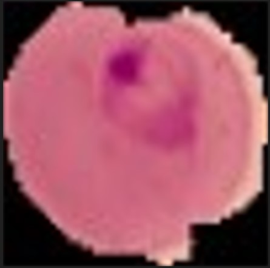
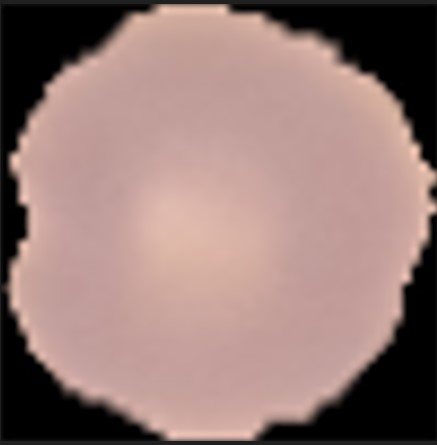
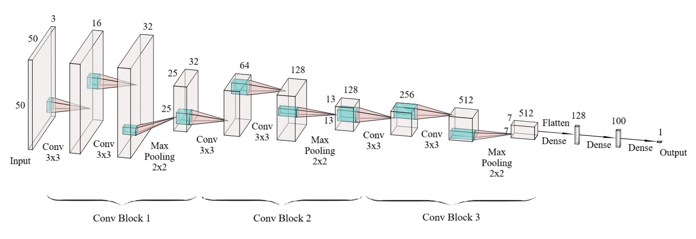
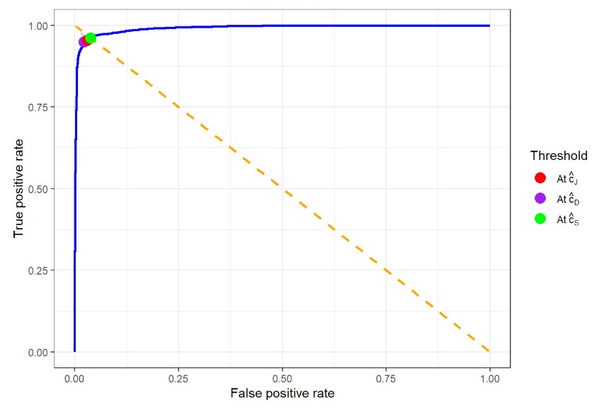
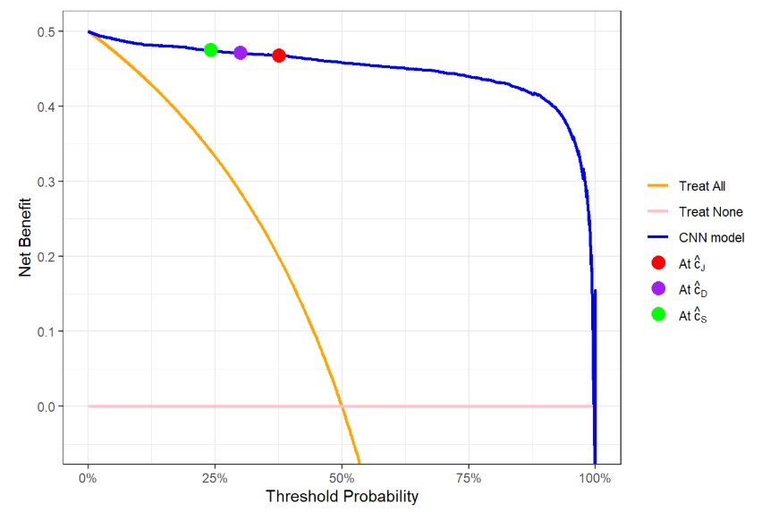

# Malaria Cell Image Classification with a Custom CNN Architecture

## Overview

Malaria is a life-threatening infectious disease caused by *Plasmodium* parasites and remains a major global health concern. Among the five known *Plasmodium* species infecting humans, *Plasmodium falciparum* is responsible for the most severe and fatal cases.

This project implements a Convolutional Neural Network (CNN) to automatically detect the presence of *Plasmodium falciparum* parasites in Giemsa-stained red blood cell images as part of my master's thesis. The task is formulated as a binary image classification problem, distinguishing between parasitized and uninfected red blood cells. This work aims to develop a deep learning–based approach that can assist in malaria screening by improving diagnostic efficiency and consistency. The code was developed and executed using RStudio.

## Data

This project uses the Malaria Cell Images dataset, which contains 28,115 images of Giemsa-stained red blood cells collected from thin blood smears. The images are divided into two classes: *Parasitized* and *Uninfected*. The dataset is publicly available at: <https://www.kaggle.com/datasets/iarunava/cell-images-for-detecting-malaria>

{width="151"} {width="147"}

***Figure 1:** Images of parasitized and uninfected red blood cells*

The dataset consists of RGB images with heights ranging from 40 to 385 pixels and widths ranging from 46 to 394 pixels. All images were resized to 50 × 50 pixels using bilinear interpolation. The dataset was split into training, validation, and test sets following a 70:10:20 ratio. Because pixel values in the training set already lie within the range [0, 1], no additional image normalization was required.

## Methods

A CNN was built from scratch using Tensorflow to classify malaria-infected and uninfected red blood cell images. The model construction followed these steps:

-   A sequential model was initialized, with the input defined as an RGB image of size 50 $\times$ 50 pixels.

-   Feature extraction is performed using 6 convolutional layers organized into 3 convolutional blocks, with increasing numbers of filters (16, 32, 64, 128, 256, and 512). All convolutional layers use 3 $\times$ 3 kernels, followed by batch normalization and ReLU activation. Max pooling layers with a 2 $\times$ 2 pool size and dropout layers with a dropout rate of 0.2 are added at the end of every convolutional block.

-   The extracted feature maps are flattened using a flatten layer and passed to 2 fully connected (FC) layers with 128 and 100 units, respectively. Each FC layer is followed by batch normalization, ReLU activation, and a dropout layer with a dropout rate of 0.4.

-   Finally, the output layer is defined as a FC layer with 1 unit and sigmoid activation, producing a probability score that indicates the likelihood that an input image belongs to the Parasitized class.

{width="813"}

The resulting model was trained using the Stochastic Gradient Descent (SGD) optimizer with a learning rate of 0.007 and momentum of 0.9, together with Binary Cross-Entropy (BCE) loss. Training was performed with a batch size of 32 for 20 epochs. Model performance was monitored using Area Under the ROC Curve (AUC) and loss on both the training and validation sets across all epochs.

The final CNN model was evaluated using Receiver Operating Characteristic (ROC) curve, Decision curve and Area Under the ROC Curve (AUC). Afterwards, the three ROC - based criteria and the net benefit function were used to find the optimal classification threshold for the model.

#### ROC curve and AUC

> *The Receiver Operating Characteristic curve (**ROC curve**) is a plot of sensitivity against 1 - specificity across different classification thresholds and is used to evaluate the performance of a binary classification model. A ROC curve closer to the top-left corner indicates better classification performance.*
>
> *The Area Under the ROC Curve (**AUC**) is a standard metric for evaluating binary classification performance, with values closer to 1 indicating stronger discriminative ability and 0.5 corresponding to random guessing.*

#### Decision curve

> ***Decision curve** is a plot of the net benefit as a function of the classification threshold and is used to evaluate the clinical utility of a binary classification model. In Decision Curve Analysis (DCA), two default treatment strategies—“Treat none” and “Treat all”—are used as reference baselines for comparison with predictive models.*

#### Classification threshold

> *In medical diagnosis with binary disease classification, the diagnostic outcome distinguishes between diseased and non-diseased individuals. A predictive model estimates the probability that a patient has the disease based on their clinical features. A **classification threshold** is then used to convert this probability into a diagnostic decision: patients with predicted probabilities above the threshold are classified as positive (diseased), while those below the threshold are classified as negative (non-diseased).*

#### Optimal threshold selection

> *To select the best classification threshold for a predictive model, three ROC-based criteria are first used to identify candidate optimal thresholds in terms of classification performance:*
>
> 1.  ***Maximizing Youden Index criterion**, which selects the threshold* $\hat{c}_{J}$ *that maximizes the sum of sensitivity and specificity;*
>
> 2.  ***Closest to (0, 1) criterion**, which selects the threshold* $\hat{c}_{D}$ *that is closest to perfect classification on the ROC space;*
>
> 3.  ***Symmetry Point criterion**, which selects the threshold* $\hat{c}_{S}$ *at which sensitivity equals specificity.*
>
> *These thresholds are then evaluated using DCA, which assesses clinical utility through net benefit. The final **optimal classification threshold** is selected as the one that provides the highest net benefit among the candidates.*

## Results

{width="552"}

\-

{width="556"}

The model's ROC curve on the test set lies close to the top-left corner, indicating strong classification performance. Furthermore, the model's decision curve on the test set shows that the CNN provides a higher net benefit than both the “Treat all” and “Treat none” strategies across most classification thresholds, reflecting high clinical utility. The model obtained an AUC of 0.9957 on the training set and 0.9911 on the test set, indicating no significant overfitting. Test set AUC evaluation results demonstrate that the proposed CNN achieves excellent classification performance.

Candidate optimal thresholds for the CNN model were computed using 3 criteria: *Maximizing Youden Index criterion, Closest to (0, 1) criterion, and Symmetry Point criterion*, yielding threshold values of 0.3763, 0.2997, and 0.2412, respectively. Among these, the threshold of 0.2412 provides the highest net benefit for the CNN model and is therefore selected as the model's final optimal classification threshold.

## References

[1] Sande, S. Z., Seng, L., Li, J., & D’Agostino, R. (2021). Statistical Learning in Medical Research with Decision Threshold and Accuracy Evaluation. *Journal of Data Science, 19(4),* 634-657. <https://doi.org/10.6339/21-JDS1022>
